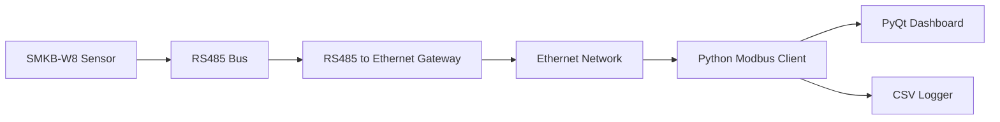
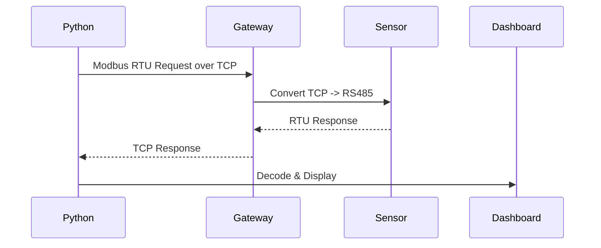

# Smart Weather Station over RS485-to-Ethernet (Modbus RTU + Python GUI)


Industrial weather monitoring system using:

- **SMKB-W8 RS485 Weather Sensor**
- **Waveshare RS485 to Ethernet Gateway**
- **Python Modbus TCP Socket Client**
- **PyQt6 Real-Time Dashboard**
- **CSV Data Logging**

---

# Features

- Real-time weather monitoring
- RS485 over Ethernet communication
- Modbus RTU polling via TCP socket
- Live PyQt dashboard
- Device address configuration
- CSV data logging
- Industrial multi-drop RS485 support
- Auto reconnect handling

---

# System Architecture



---

# Dashboard Preview

Add screenshot:

```text
docs/dashboard.png
```

Then:

```markdown

```

---

# Hardware Used

## Sensor

SMKB-W8 Ultrasonic Weather Station

Measures:

- Wind Speed
- Wind Direction
- Temperature
- Humidity
- Barometric Pressure

Default communication:

```ini
Address = 1
Baud = 9600
Data Bits = 8
Parity = None
Stop Bits = 1
```

---

## RS485 Ethernet Gateway

Waveshare RS485 TO ETH (B)

Configured as:

```ini
Mode = TCP Server
IP = 192.168.1.200
Port = 4196
Protocol Conversion = NONE
```

⚠ Must be **Transparent Mode (NONE)**

Do NOT use:

- Modbus TCP conversion mode

This project sends raw RTU frames with CRC.

---

# Wiring Connection

## Sensor Cable

| Wire | Function |
|------|----------|
| Red | Power + |
| Black | Power - / GND |
| Yellow | RS485 A (D+) |
| Green | RS485 B (D-) |

---

## RS485 Wiring

```text
SMKB-W8 Sensor                     RS485 Gateway
-----------------------------------------------------
Yellow (A+)   ------------------> 485A
Green  (B-)   ------------------> 485B
Black  GND    ------------------> GND (optional)
Red    +12V   ------------------> +12V Supply
```

---

## Wiring Diagram

Create image:

```text
docs/wiring-diagram.png
```

Then:

```markdown

```

Suggested diagram:

```text
             +12V Supply
                |
       ---------------------
       |                   |
   Weather Sensor      Gateway

Sensor A+ ------------ Gateway 485A
Sensor B- ------------ Gateway 485B
GND ------------------ GND
```

---

# Ethernet Network

```text
+----------------+
| Python PC       |
| 192.168.1.100   |
+--------+--------+
         |
      Switch
         |
+--------+--------+
| Gateway         |
|192.168.1.200    |
+-----------------+
```

Subnet:

```ini
255.255.255.0
```

---

# RS485 Bus Notes

Recommended:

- Twisted pair cable
- Shielded cable
- Daisy chain topology
- 120Ω termination at both ends
- Avoid star topology

Correct:

```text
Device---Device---Device
```

Wrong:

```text
     Device
       |
Device-+-Device
```

---

# Modbus Register Map

| Register | Parameter |
|---------|------------|
0001 | Wind Direction |
0002-0003 | Wind Speed |
0004-0005 | Temperature |
0006-0007 | Humidity |
0008-0009 | Pressure |

Float Format:

```text
IEEE754 CDAB byte swap
```

---

# Example Modbus Poll

Request:

```text
01 03 00 00 00 60 CRC
```

Python:

```python
command = [1,0x03,0x00,0x00,0x00,0x60]
```

---

# Project Structure

```bash
project/
│
├── Modbus.py
├── Modbus_Gui.py
├── dashboard_page.py
├── weather.csv
├── settings.json
│
├── docs/
│   ├── dashboard.png
│   └── wiring-diagram.png
│
└── README.md
```

---

# Installation

## Clone

```bash
git clone https://github.com/yourusername/weather-rs485-monitor.git

cd weather-rs485-monitor
```

---

## Install Dependencies

```bash
pip install pyqt6
```

---

# Run

```bash
python Modbus_Gui.py
```

Enter:

```text
IP Address : 192.168.1.200
Port       : 4196
Address    : 1
```

Press Connect.

---

# Communication Flow



---

# Example Output

```text
Wind Speed      3.42 m/s
Direction       178°
Temperature     28.76 °C
Humidity        46.30 %
Pressure        972.85 hPa
```

---

# Multi Sensor RS485 Network

Supported:

```text
Sensor 1 Address 1
Sensor 2 Address 2
Sensor 3 Address 3
```

Shared bus:

```text
A-A-A
B-B-B
```

Poll each slave independently.

---

# Address Change

Supported from GUI.

Command sequence:

```text
>*

>ID 2

>SaveConfig

>RESET
```

Changes slave address.

---

# Troubleshooting

## No Response

Check:

- A/B swapped
- Wrong baud rate
- Wrong slave ID
- Wrong IP or port
- Gateway not in transparent mode

---

## Link LED Green only

Network connected.

No TCP client connected.

---

## TX flashes, no RX

Usually:

- RS485 reversed
- Wrong serial settings

---

## Python Timeout

Check:

```python
host="192.168.1.200"
port=4196
```

---

# Future Improvements

Planned:

- MQTT Support
- Modbus TCP Native Mode
- Database Logging
- Grafana Dashboard
- SCADA Integration
- Alarm Notifications

---

# Industrial Notes

Recommended for field deployments:

- Surge protection
- Isolated RS485 transceiver
- Shield grounding one side only
- UPS-backed gateway
- Watchdog auto-reconnect

---

# Bill of Materials

| Item | Qty |
|-----|----|
SMKB-W8 Sensor | 1
RS485-ETH Gateway | 1
24V / 12V Supply | 1
Shielded RS485 Cable | 1
Ethernet Cable | 1

---

# License

MIT

---

# Author

Your Name  
Industrial Automation / Modbus / Embedded Systems

---

# Star This Project

If this helped you:

⭐ Star the repo
